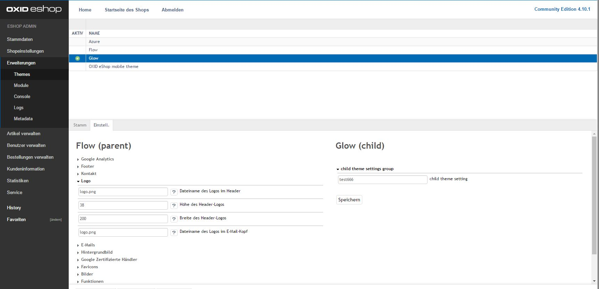

## ___MODULE___


example of my theme.php

```php
<?php
$aTheme = [
    'id'           => 'glow',
    'title'        => 'Glow',
    'description'  => 'cleaned, updated and bugfixed flow theme for oxid eshop 4.9 / 4.10',
    'thumbnail'    => 'theme.jpg',
    'version'      => '0.1.0',
    'parentTheme'  => 'flow',
    'parentVersions'=> ['1.0.0','1.0.0-beta.3'],
    'author'       => 'Marat Bedoev',
    'settings' => [
       [
          'group' => 'main',
          'name' => 'aThemeSetting',
          'type' => 'str',
          'value' => 'test'
       ]
    ]
];
```
screenshot:


### LICENSE AGREEMENT
   ___MODULE___  
   Copyright (C) ___YEAR___  ___COMPANY___  
   info:  ___EMAIL___  
  
   This program is free software;  
   you can redistribute it and/or modify it under the terms of the GNU General Public License as published by the Free Software Foundation;
   either version 3 of the License, or (at your option) any later version.
  
   This program is distributed in the hope that it will be useful, but WITHOUT ANY WARRANTY;  
   without even the implied warranty of MERCHANTABILITY or FITNESS FOR A PARTICULAR PURPOSE. See the GNU General Public License for more details.
   You should have received a copy of the GNU General Public License along with this program; if not, see <http://www.gnu.org/licenses/>